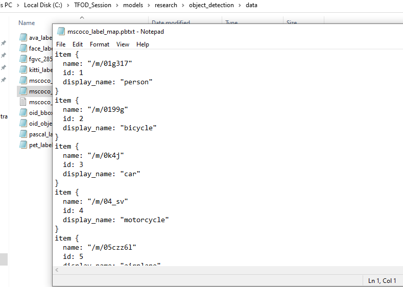
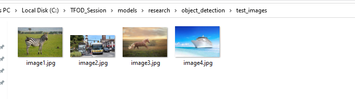
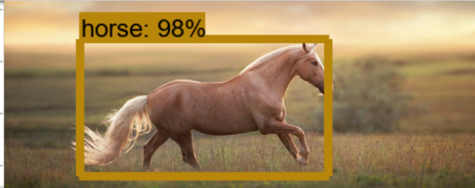
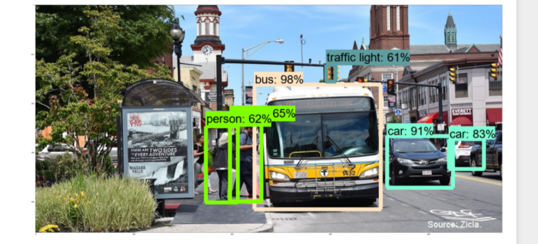

# Object-Detection-using-TensorFlow-and-COCO-Pre-Trained-Model

# Introduction

This repository for how to use TensorFlow's Object Detection API to pre-trained an object detection classifier
for multiple objects on Windows 10. It was originally written using TensorFlow version 1.3 and pre-trained model is 
ssd_mobilenet_v1_coco.

# Steps

## 1. Install Anaconda
   Anaconda is a software toolkit that creates virtual Python environments so you can install and 
   use Python libraries without worrying about creating version conflicts with existing installations. 
   Download Anaconda for Windows from their webpage (https://www.anaconda.com/products/individual). 
   Once it's downloaded, execute the installer file and work through the installation steps.

## 2. Set up TensorFlow Directory and Anaconda Virtual Environment
   The TensorFlow Object Detection API requires using the specific directory structure provided in its GitHub 
   repository. It also requires several additional Python packages, and a few extra setup commands to get everything 
   set up to run an object detection model.

### 2a. Download TensorFlow Object Detection API repository from GitHub

    Create a folder directly in C: and name it “TFOD_Session”. This working directory will contain the full TensorFlow 
    object detection framework, as well as test images, test data, trained classifier, configuration files, and 
    everything else needed for the object detection classifier.

    Download the full TensorFlow object detection repository located at https://github.com/tensorflow/models with tags “v1.13.0” by clicking
    the “ Download” button and downloading the zip file. Open the downloaded zip file and extract the folder directly into the C:\TFOD_Session directory you just created. Rename extracted file to just “models”.

### 2b. Download the ssd_mobilenet_v1_coco model from TensorFlow's model
    
    TensorFlow provides several object detection models (pre-trained classifiers with specific neural network architectures) in its model zoo (https://github.com/tensorflow/models/blob/master/research/object_detection/g3doc/tf1_detection_zoo.md). 
    The SSD-MobileNet model give faster detection but with less accuracy, while some models such as the Faster-RCNN model give slower detection but with more accuracy. Here detection with the SSD-MobileNet-V1 model.

### 2c. Set up new Anaconda virtual environment
    
    Next, we'll work on setting up a virtual environment in Anaconda for tensorflow-gpu. 
    From the Start menu in Windows, search for the Anaconda Prompt utility, right click on it, 
    and click “Run as Administrator”. If Windows asks you if you would like to allow it to make changes to your computer, 
    click Yes.
    
    In the command terminal that pops up, create a new virtual environment called “tfod” by issuing the following command:
             
                 C:\> conda create -n tfod python=3.6
    Then, activate the environment:
                
                C:\> conda activate tfod
    Install the other necessary packages by issuing the following command:
       
               (tfod) C:\> pip install pillow lxml Cython contextlib2 jupyter matplotlib pandas opencv-python tensorflow==1.14.0
    
### 2d. Compile Protobufs and run setup.py
 
    Next, compile the Protobuf files, which are used by TensorFlow to configure model and training parameters.
    Every ".proto" file in the \object_detection\protos directory must be called out individually by the command.
  
    Before that, in the Anaconda Command Prompt, change directories to the TFOD_Session\models\research directory:
          
          # conda package manager
          (tfod) C:\TFOD_Session\models\research> conda install -c anaconda protobuf   

          #for windows,linux,mac
          (tfod) C:\TFOD_Session\models\research> protoc object_detection/protos/*.proto --python_out=.  
   
    This creates a name_pb2.py file from every name.proto file in the \object_detection\protos folder. 
    
    Finally, run the following commands from the C:\tensorflow1\models\research directory:
           
           (tfod) C:\TFOD_Session\models\research> python setup.py install

### 2e. Setup Jupyter Notebook
    
    The TensorFlow Object Detection API is now all set up to use pre-trained models for object detection.
    We can test it out and verify installation is working by launching the object_detection_tutorial.ipynb 
    script with Jupyter. From the \object_detection directory, issue this command:
    (Before that move "object_detection_tutorial.ipynb" file from "object_detection" directory to "research" directory)
    
           (tfod) C:\TFOD_Session\models\research> jupyter-notebook object_detection_tutorial.ipynb 

## 3. Label map
   
   The label map tells what each object is by defining a mapping of class names to class ID numbers. 
   coco model trained for 90 different objects
   Label map save it as "mscoco_label_map.pbtxt" in the C:\TFOD_Session\models\research\object_detection\data folder.
   
     

## 4. Setup Testing data

      

## 5. Test the Model

  ### - Created Model Result:

     

     
